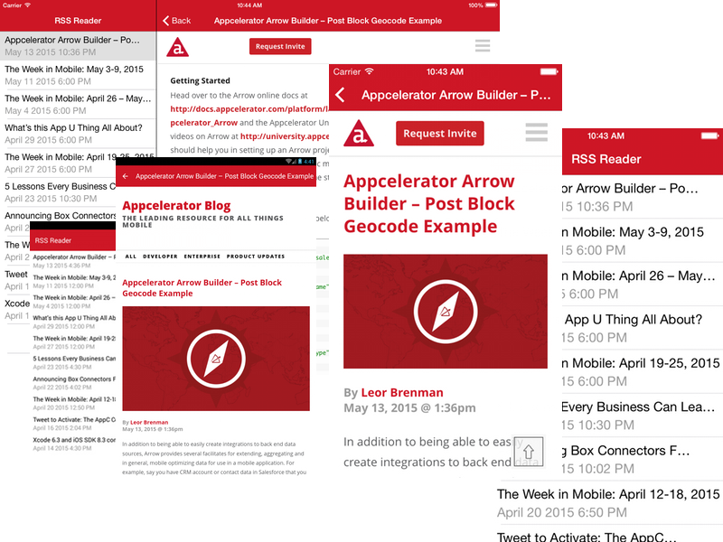

# Sample.RSS

This is a Titanium Alloy sample app that creates a RSS reader. With it you can pull a live RSS feed from the internet, list the articles and then drill down to the article itself.

## Topics Covered

* Custom Android theme.
* Alloy Collection, Models and data-binding.
* Custom Alloy sync adapter for RSS.
* Global styles via [app.tss](app/styles/app.tss).
* Configuration via [config.json](app/config.json).
* Maximum code re-use via `<Require />`.
* Cross-platform navigation in a single [controller](app/controllers/index.js)-[view](app/views/index.xml) using conditional code.
* iOS NavigationWindow.
* Android ActionBar Menu.
* WebViews.

## History
The original classic version was done by Tony Lukasavage. Fokke Zandbergen later made the Alloy version.